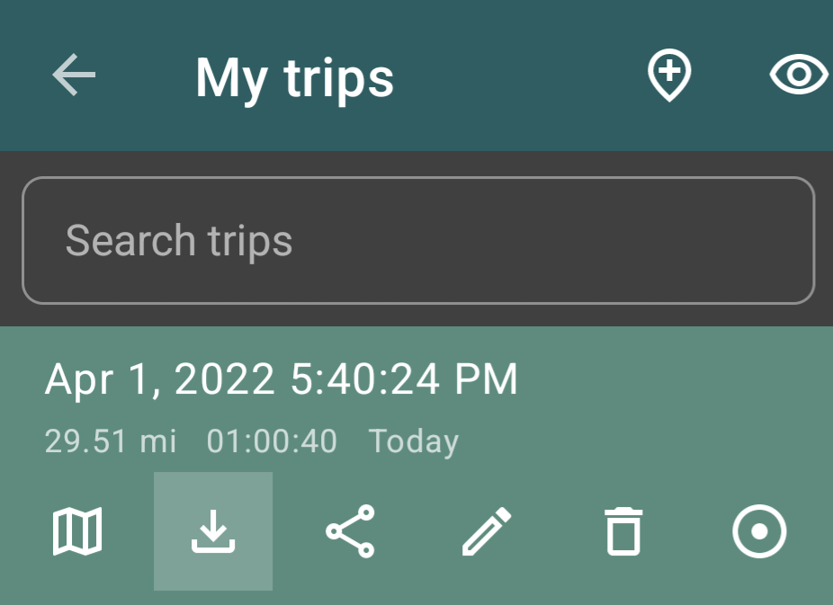

# Trip Tracker Splunk App


## Splunk Setup

### App Installation

1. Download [trip_tracker.spl](https://github.com/sidward35/splunk-trip-tracker/releases/download/v1.0.0/trip_tracker.spl).

2. In Splunk, click on the `Apps` dropdown menu (top left) > `Manage Apps` > `Install app from file` (top right).

3. Upload the downloaded `trip_tracker.spl` file.

### HEC Input Setup

4. In the top right go to `Settings` > `Data Inputs` > `HTTP Event Collector` > `Global Settings`.

5. Set "All Tokens" to `Enabled`, uncheck "Enable SSL", and ensure that "HTTP Port Number" is set to `8088`. Click `Save`.

6. Click `New Token` and on the next page, enter a name for the input in the corresponding box (e.g. `TripTracker`). Click `Next`.

7. In the "Select Allowed Indexes" section, select `main`. Click `Review` > `Submit`.

8. Copy/save the HEC token that should now be displayed. This will be used by the Python script we will run later.

## Trip Tracking and Export to Splunk

9. Download the [Geo Tracker - GPS tracker](https://play.google.com/store/apps/details?id=com.ilyabogdanovich.geotracker) app and record some trips.

10. Once a trip is recorded, export the trip files (from the sidebar on the left) **in GPX format**. Copy that file onto your computer. (Or, alternatively, setup [Termux](https://termux.com) to run Python scripts right from your phone.)


11. Download [parse_gpx.py](https://raw.githubusercontent.com/sidward35/splunk-trip-tracker/main/parse_gpx.py). Edit line 64 and replace SPLUNK_IP and HEC_TOKEN with the IP address of your Splunk instance and the HEC token you created earlier.
```
parseXML(new_file, 'SPLUNK_IP', 'HEC_TOKEN', 'geotracker')
```

12. Run `python parse_gpx.py TRIP_GPX_FILE` where TRIP_GPX_FILE is the GPX file you exported from the mobile app. (To take this one step further and automatically run this command through [Termux](https://termux.com) upon exporting your GPX file, setup an action on [Llamalab's Automate](https://llamalab.com/automate) with the [Termux plugin](https://llamalab.com/automate/community/flows/38833).)

13. And that's it! Head into the Trip Tracker app in Splunk to take a look at the OOTB dashboards, which should now be populated with data.
